# Meta Media Spatial App Code Lab

## Requirements
1. [Android Studio](https://developer.android.com/studio)
2. Android SDK 34, and build tools.
3. Quest devices with Horizon OS v69+, and developer mode enabled.
4. (Optional) Android Emulator.

## 1. Run the sample app on Meta Quest.
* Port a mobile Android app to Meta Quest device
* Create build variants with [ProductFlavors](https://developer.android.com/reference/tools/gradle-api/7.4/com/android/build/api/dsl/ProductFlavor) to showcase Cross-platform-ness (one codebase, multiple targets).

### 1.1 Setup
1. Make sure the [requirements](#requirements) are met.
2. Download the project [zip](https://codeload.github.com/fbsamples/MediaSpatialAppTemplate/zip/refs/heads/main), and unzip the project.
3. Open and import the project into Android Studio, wait the project synced by the gradle task.
4. Switch the Android Studio to Project view.  
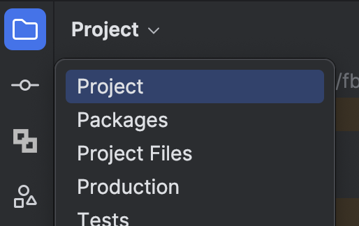

5. (Optional) Start the app in Android Emulator. You will see something like the following screenshot. Then stop the running Android device.  
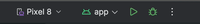  
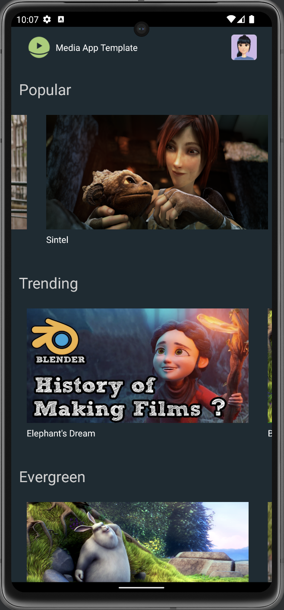

### 1.2 Add quest build flavor
1. Open the `build.gradle.kts` in app module(`{projectRoot}/app`), and add following code into the `android` block.
```diff
android {
  namespace = "com.meta.media.template"
  ...

+ buildFeatures { buildConfig = true }
+ flavorDimensions += "device"
+ productFlavors {
+  create("mobile") { dimension = "device" }
+  create("quest") { dimension = "device" }
+ }
}
```
2. Create two new folders under `{projectRoot}/app/src` with names `mobile` and `quest`. We'll use these folders to manage the differences between the phone version and the Meta Quest version of our app.
3. Copy the `AndroidManifest.xml` from `{projectRoot}/src/main` folder into the new folders.  
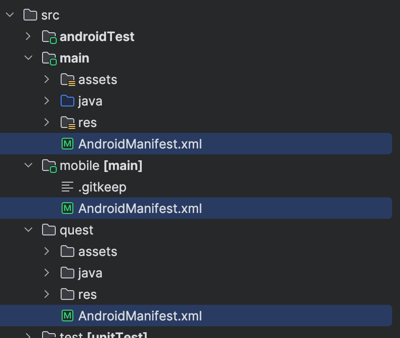

4. Sync the project with the new gradle config.
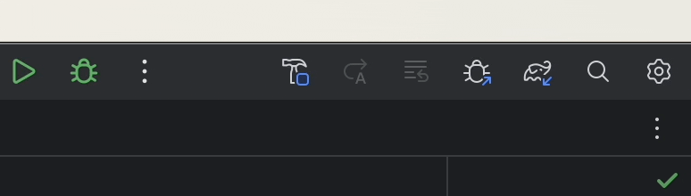  

5. Switch current build variant to 'quest'. In menu, select `Build -> Select Build Variant`. In the Build Variants window, select `questDebug` as the active build variant.
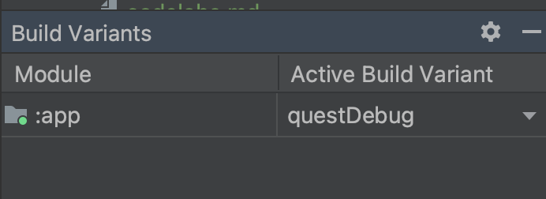  

6. Open the `AndroidManifest.xml` under `{projectRoot}/app/src/quest` folder, add `android:screenOrientation` inside `activity` tag of the `MainActivity`, and set the screen orientation to landscape.
```diff
<?xml version="1.0" encoding="utf-8"?>
...
   <application
       ...
   <activity
           android:name=".MainActivity"
+          android:screenOrientation="landscape"
...
```
7. Connect a Meta Quest device to your MAC/PC, select the connected device in Android Studio as the target device, and start the app.  
   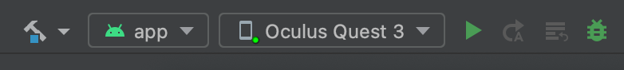
8. Put on your headset, you will see the app is launched in landscape mode.  
   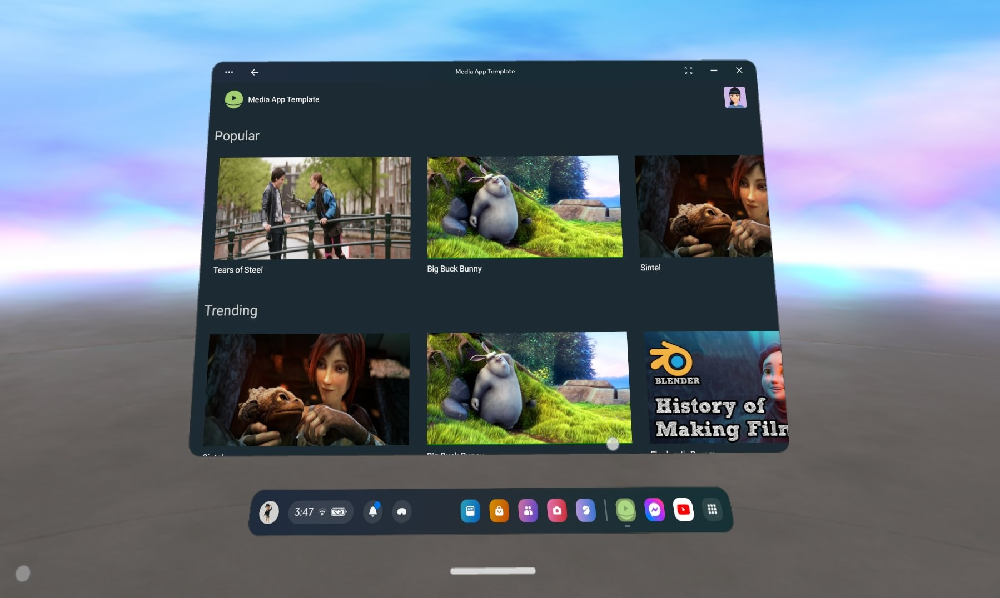

## 2. Display the app in an immersive scene
* Add Meta Spatial SDK into the project
* Create an immersive scene with skybox and room environment
* Render the Android app as a panel in the immersive scene

### 2.1 Add Meta Spatial SDK
1. Import the libraries from Maven into the project by updating the `build.gradle.kts` under `{projectRoot}/app` folder. Then sync the project with the new gradle config. If everything works fine, skip step 2 and 3.
```diff
dependencies {
...
  implementation("androidx.media3:media3-ui:1.3.1")

+ implementation("com.meta.spatial:meta-spatial-sdk:0.5+")
+ implementation("com.meta.spatial:meta-spatial-sdk-physics:0.5+")
+ implementation("com.meta.spatial:meta-spatial-sdk-toolkit:0.5+")
+ implementation("com.meta.spatial:meta-spatial-sdk-vr:0.5+")

  testImplementation("junit:junit:4.13.2")
...
}
```
2. **(Skip this if step 1 works)**. *Create a new folder named `libs` under `{projectRoot}/app` folder, and copy all .aar files from `{projectRoot}/codelabs/resources/libs` to here*.  
   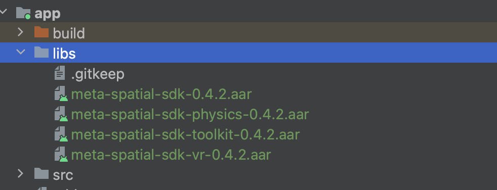
3. **(Skip this if step 1 works)**. *Update the `build.gradle.kts` under `{projectRoot}/app` folder, and add following dependencies. Sync the project with the new gradle config*.
```diff
dependencies {
...
  implementation("androidx.media3:media3-ui:1.3.1")

+ implementation (files("libs/meta-spatial-sdk-0.5.0.aar"))
+ implementation (files("libs/meta-spatial-sdk-physics-0.5.0.aar"))
+ implementation (files("libs/meta-spatial-sdk-toolkit-0.5.0.aar"))
+ implementation (files("libs/meta-spatial-sdk-vr-0.5.0.aar"))
+ // Meta Spatial SDK dependencies
+ implementation ("com.squareup.okhttp3:okhttp:4.9.1")

  testImplementation("junit:junit:4.13.2")
...
}
```

### 2.2 Start an immersive scene
1. Copy the skybox image `skybox.jpg` from `{projectRoot}/codelabs/resources/assets` to `{projectRoot}/app/src/quest/res/drawable`, and copy the room model file `environment.glb` from `{projectRoot}/codelabs/resources/assets` to `{projectRoot}/app/src/quest/assets`.  
   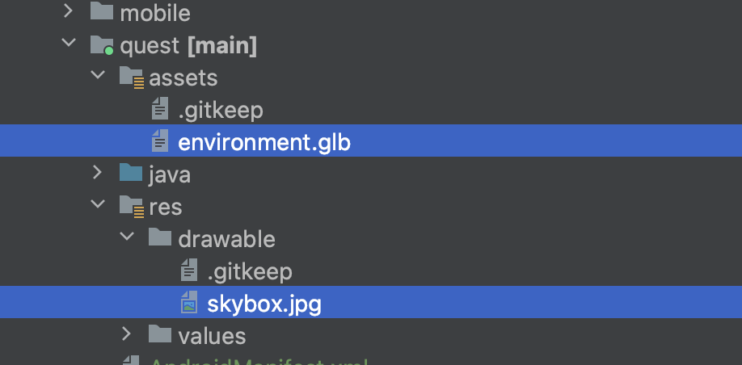
2. Under `{projectRoot}/app/src/quest` folder, create a new folder named `java`, and then create a new package `com.meta.media.template` under `java`.
3. Create a new kotlin file `ImmersiveActivity.kt` under the package we created with following content.
```kotlin
package com.meta.media.template

import com.meta.spatial.core.SpatialFeature
import com.meta.spatial.toolkit.AppSystemActivity
import com.meta.spatial.vr.VRFeature

class ImmersiveActivity : AppSystemActivity() {

   override fun registerFeatures(): List<SpatialFeature> {
      return listOf(VRFeature(this))
   }

   override fun onSceneReady() {
      super.onSceneReady()
      scene.setViewOrigin(0.0f, 0.0f, 0.0f)
   }
}
```
4. Inside `onSceneReady()` methods, create three entities, a room environment, a skybox and a red cube.
```diff
+import android.net.Uri
+import com.meta.spatial.core.Entity
+import com.meta.spatial.core.Pose
+import com.meta.spatial.core.Quaternion
+import com.meta.spatial.core.Vector3
+import com.meta.spatial.toolkit.Box
+import com.meta.spatial.toolkit.Color4
+import com.meta.spatial.toolkit.Material
+import com.meta.spatial.toolkit.Mesh
+import com.meta.spatial.toolkit.Transform

   override fun onSceneReady() {
      super.onSceneReady()
      scene.setViewOrigin(0.0f, 0.0f, 0.0f)

+    // Create Entities
+    Entity.create(
+        listOf(
+            Mesh(mesh = Uri.parse("environment.glb")),
+            Transform(Pose(Vector3(0f, 0f, 1f), Quaternion(0f, 180f, 0f)))))

+    Entity.create(
+        listOf(
+            Mesh(Uri.parse("mesh://skybox")),
+            Material().apply {
+              baseTextureAndroidResourceId = R.drawable.skybox
+              unlit = true
+            }))

+    Entity.create(
+        listOf(
+            Mesh(Uri.parse("mesh://box")),
+            Box(Vector3(-0.1f, -0.1f, -0.1f), Vector3(0.1f, 0.1f, 0.1f)),
+            Material().apply {
+              baseColor = Color4(red = 1.0f, green = 0.1f, blue = 0.1f, alpha = 1.0f)
+            },
+            Transform(Pose(Vector3(0.0f, 0.2f, 1.5f), Quaternion(0f, 0f, 0f)))))

      )
   }
```
5. Open the `AndroidManifest.xml` under `{projectRoot}/app/src/main`, comment out the `activity` tags under the `application` tags.  
   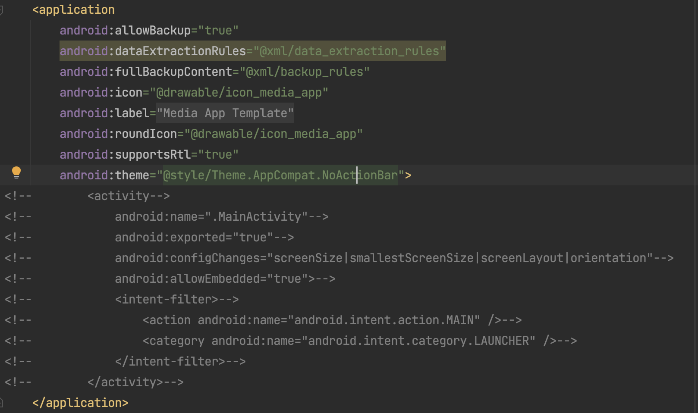
6. Open the `AndroidManifest.xml` under `{projectRoot}/app/src/quest`, add the new ImmersiveActivity inside the `application` tag, comment out the `intent-filter` from MainActivity.
```diff
...
    <application
    ...
    android:theme="@style/Theme.AppCompat.NoActionBar">
        <activity
            android:name=".MainActivity"
            android:screenOrientation="landscape"
            android:exported="true"
            android:allowEmbedded="true">
-           <intent-filter>
-               <action android:name="android.intent.action.MAIN" />
-               <category android:name="android.intent.category.LAUNCHER" />
-           </intent-filter>
        </activity>
+       <activity
+            android:name=".ImmersiveActivity"
+            android:theme="@android:style/Theme.Black.NoTitleBar.Fullscreen"
+            android:launchMode="singleTask"
+            android:excludeFromRecents="false"
+            android:screenOrientation="landscape"
+            android:configChanges="screenSize|screenLayout|orientation|keyboardHidden|keyboard|navigation|uiMode"
+            android:exported="true">
+            <intent-filter>
+                <action android:name="android.intent.action.MAIN" />
+                <category android:name="com.oculus.intent.category.VR" />
+                <category android:name="android.intent.category.LAUNCHER" />
+            </intent-filter>
+        </activity>
    </application>
```
7. Open the `AdnroidManifest.xml` under `{projectRoot}/app/src/quest`, with following code changes under `manifest` tag. This step adds Meta Quest features and permissions for the app.
```diff
<?xml version="1.0" encoding="utf-8"?>
<manifest xmlns:android="http://schemas.android.com/apk/res/android"
    xmlns:tools="http://schemas.android.com/tools">

+   <!-- Meta Quest/VR Specific Features/Permissions -->
+   <!-- Support controller models -->
+   <uses-feature
+       android:name="com.oculus.feature.RENDER_MODEL"
+       android:required="false" />
+   <uses-permission android:name="com.oculus.permission.RENDER_MODEL" />
+   <!-- App runs in 6DoF mode -->
+   <uses-feature android:name="android.hardware.vr.headtracking"
+       android:required="true" />
+   <!-- Support hand tracking -->
+   <uses-feature
+       android:name="oculus.software.handtracking"
+       android:required="false" />
+   <uses-permission android:name="com.oculus.permission.HAND_TRACKING" />

    <uses-permission android:name="android.permission.INTERNET" />
...
```
8. Start the app on Meta Quest device, and you should see an immersive scene like below.  
   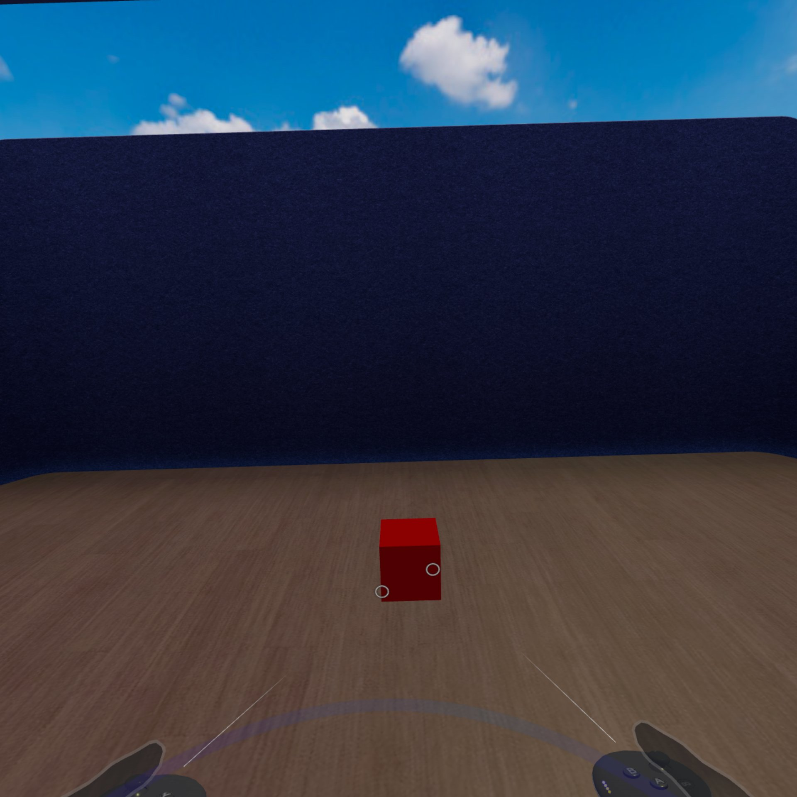

### 2.3 Import the panel
1. Under `{projectRoot}/app/src/quest/res/values` folder, create a new resource file `ids.xml` with following content.
```xml
<resources>
    <item type="id" name="main_panel" />
</resources>
```
2. In `ImmsersiveActivity.kt`, override the method `registerPanels` in ImmersiveActivity class to register a panel configuration.
```diff
+import android.content.Intent
+import com.meta.spatial.toolkit.PanelRegistration
+import com.meta.spatial.runtime.AlphaMode
+import com.meta.spatial.runtime.QuadLayerConfig
+import com.meta.spatial.runtime.SceneMaterial

...
  }

+  override fun registerPanels(): List<PanelRegistration> {
+    return listOf(
+        PanelRegistration(R.id.main_panel) {
+          panelIntent =
+              Intent().apply {
+                setClassName(applicationContext, MainActivity::class.qualifiedName!!)
+              }
+          config {
+            height = 2.16f
+            width = 3.84f
+            layoutHeightInPx = 1080
+            layoutWidthInPx = 1920
+            layerConfig = QuadLayerConfig()
+            panelShader = SceneMaterial.HOLE_PUNCH_SHADER
+            alphaMode = AlphaMode.HOLE_PUNCH
+          }
+        })
+  }

  override fun onSceneReady() {
...
```
3. In `ImmsersiveActivity.kt`, add following code to `onSceneReady` method to create a Panel Entity.
```diff
+import com.meta.spatial.toolkit.createPanelEntity

override fun onSceneReady() {
  ...

+   Entity.createPanelEntity(
+      R.id.main_panel,
+      Transform(Pose(Vector3(0f, 1.3f, 2f), Quaternion(0f, 0f, 0f)))
+   )
}
```
4. Start the app, you should see the panel is displayed in the center of the scene.  
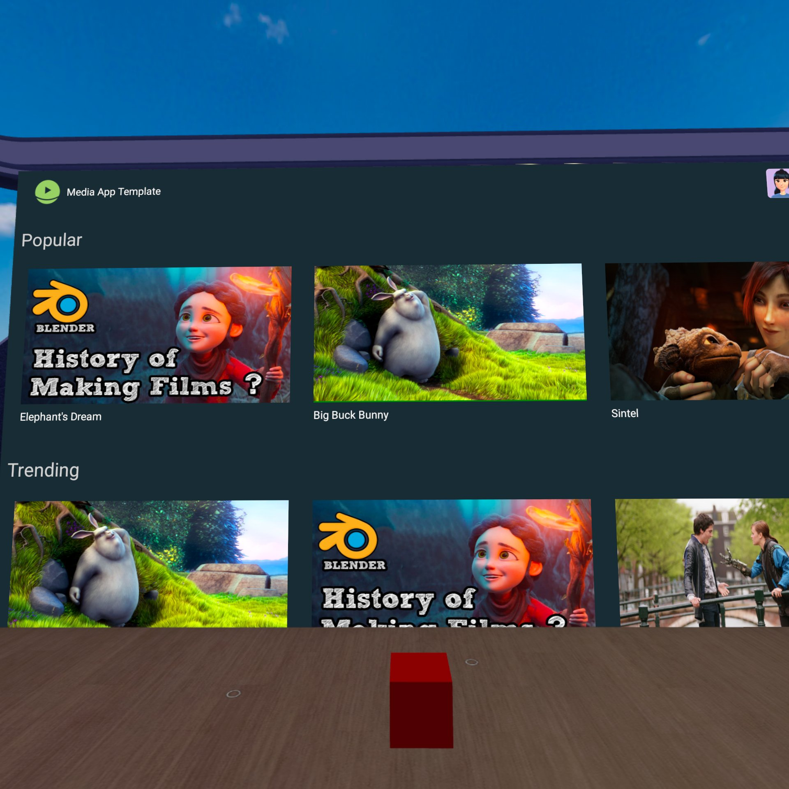

## 3. Core 3D capabilities
* Add lighting to the immersive environment
* Import gltf 3D model to the scene
* Basic physics for 3D

### 3.1 Add Lighting
1. Copy the IBL(Image Based Lighting) file `chromatic.env` from `{projectRoot}/codelabs/resources/assets` to `{projectRoot}/app/src/quest/assets`.  
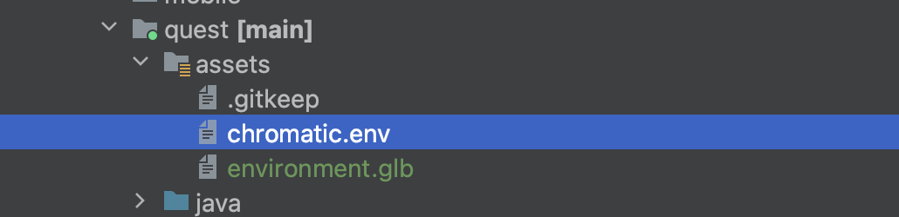

2. In `ImmersiveActivity.kt`, add following code to `onSceneReady` method.

```diff
  override fun onSceneReady() {
    super.onSceneReady()
    scene.setViewOrigin(0.0f, 0.0f, 0.0f)
+   scene.setLightingEnvironment(
+     ambientColor = Vector3(1.0f, 1.0f, 0.5f),
+     sunColor = Vector3(1.0f, 1.0f, 0.5f),
+     sunDirection = -Vector3(1.0f, 3.0f, 2.0f),
+     environmentIntensity = 0.5f
+   )
+   scene.updateIBLEnvironment("chromatic.env")
  ...
  }
```

3. Start the app, now the scene becomes much brighter.  
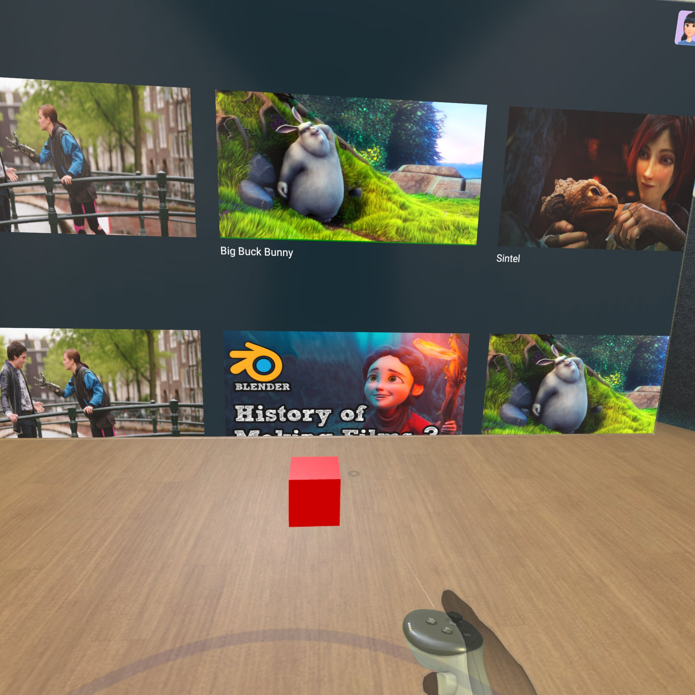

### 3.2 Enable physics
1. Enable the PhysicsFeature by updating the `registerFeatures` method in `ImmersiveActivity`.
```diff
+import com.meta.spatial.physics.PhysicsFeature

...
  override fun registerFeatures(): List<SpatialFeature> {
-    return listOf(VRFeature(this))
+    return listOf(VRFeature(this), PhysicsFeature(spatial))
  }
...
```
2. Copy the media controller model file `Controller.glb` from `{projectRoot}/codelabs/resources/assets` to `{projectRoot}/app/src/quest/assets`.
3. In `ImmersiveActivity`'s `onSceneReady` method, Replace the cube entity with the media controller model, including `Grabbable` and `Physics` components.
```diff
+import com.meta.spatial.physics.Physics
+import com.meta.spatial.physics.PhysicsState
+import com.meta.spatial.toolkit.Grabbable

...
  override fun onSceneReady() {
    super.onSceneReady()
...

-    Entity.create(
-        listOf(
-            Mesh(Uri.parse("mesh://box")),
-            Box(Vector3(-0.1f, -0.1f, -0.1f), Vector3(0.1f, 0.1f, 0.1f)),
-            Material().apply {
-              baseColor = Color4(red = 1.0f, green = 0.1f, blue = 0.1f, alpha = 1.0f)
-            },
-            Transform(Pose(Vector3(0.0f, 0.2f, 1.5f), Quaternion(0f, 0f, 0f)))))

+    Entity.create(
+        listOf(
+            Mesh(Uri.parse("Controller.glb")),
+            Transform(Pose(Vector3(0.0f, 0.2f, 0.5f), Quaternion(0f, 0f, 0f))),
+            Grabbable(),
+            Physics(
+                dimensions = Vector3(0.1f, 0.04f, 0.24f),
+                density = 0.01f,
+                state = PhysicsState.DYNAMIC),
+        ))

    Entity.createPanelEntity(
        R.id.main_panel, Transform(Pose(Vector3(0f, 1.3f, 2f), Quaternion(0f, 0f, 0f))))
  }

```
4. Inside `onSceneReady` method, create an invisible floor so the media controller can drop on it and won't fall out of the scene.
```diff
...
  override fun onSceneReady() {
    super.onSceneReady()
...

    Entity.create(
        listOf(
            Mesh(Uri.parse("Controller.glb")),
            Transform(Pose(Vector3(0.0f, 0.2f, 0.5f), Quaternion(0f, 0f, 0f))),
            Grabbable(),
            Physics(
                dimensions = Vector3(0.1f, 0.04f, 0.24f),
                density = 0.01f,
                state = PhysicsState.DYNAMIC),
        ))

+    Entity.create(
+        listOf(
+            Transform(Pose(Vector3(0f, -0.4f, 0f), Quaternion(0f, 0f, 0f))),
+            Physics(dimensions = Vector3(10f, 0.5f, 10f), state = PhysicsState.STATIC)))
...
}
```
5. Start the app, try grab the media controller from the floor with the grab key, then release the grab key to see what happens.  
   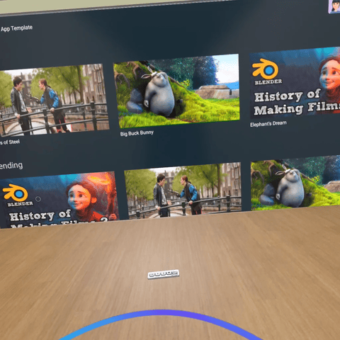

## 4. Learning the Spatial Editor basics

In this section, you will learn the basics of using Meta Spatial Editor and replace the scene of your Media app with a Spatial Editor Project. For more info, [check out the Meta Spatial Editor documentation](https://developers.meta.com/horizon/documentation/spatial-sdk/spatial-editor-overview). This section will teach you how to:

- Create a new project
- Add assets
- Create and edit compositions and objects
- Layout scenes by adding compositions and objects
- Add Spatial SDK components to objects

### 4.1 Create a new project

First, open Meta Spatial SDK. If you have existing projects they will appear on the right side panel. You'll also have the option to open an existing project and create a new one. Click New Project.

### 4.2 What do the different UI sections do?

Now that you have a new, empty object, let's walk through the different sections of the UI.

   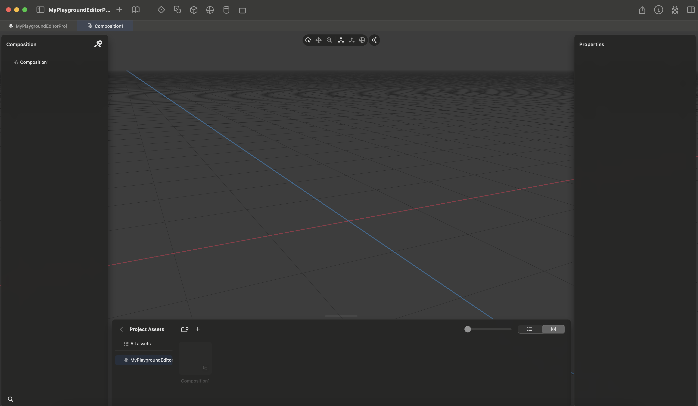

#### Top Bar
The top bar contains different ways to add objects, compositions, and panels. There is also the book icon, which opens up the asset library. You can use it to download various different assets to use in your scene.

#### Left Side Panel
The left side panel contains the structural hierarchy of your project. You can parent different nodes (objects/compositions) so that their location is relative to their parent. You can also perform actions like adding and deleting nodes.

#### Right Side Panel
The right side panel contains different properties about the currently selected node. You can change values like transformation, rotation, and scale (TRS) and even add Spatial SDK Components here.

#### Bottom Panel
This is where your reusable assets are stored. You can import, manage, and delete assets here, or add them to your scene.

### 4.3 Adding assets to the scene
We create our scene layouts by adding assets as objects to our compositions. These often represent the scene of your app, but can represent smaller parts as well.

#### Add a basketball
To try making a scene, first click on the asset library button (the book icon) on the top bar. Let's click on the basketball so we can download it and add it to our scene.

   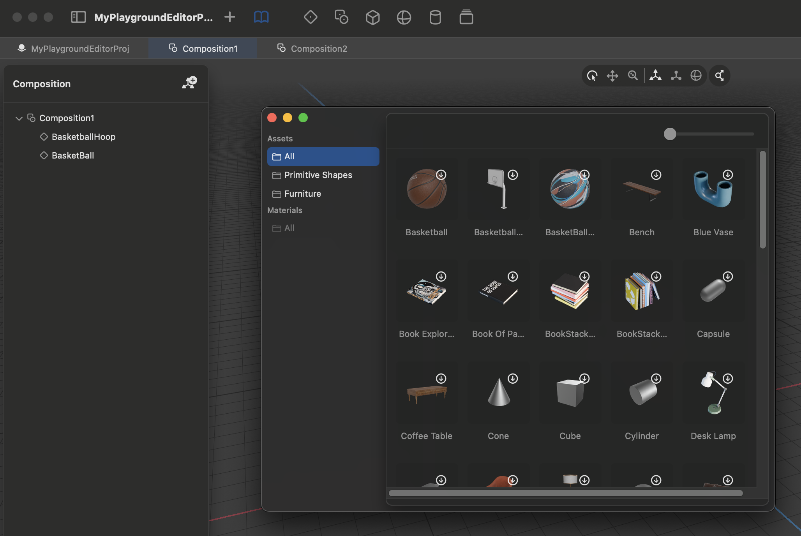

#### Move the basketball
The basketball will start at the origin of the composition. We can use the gizmos to move it around the scene. Let's move it up and away from the origin a little bit. You can also manually edit the transformation values on the right side panel.

#### Make the basketball larger
We can also switch which gizmo we use and use it to scale the basketball to be smaller or larger. You can swap gizmos using the small little toolbar near the top of the view. We can also manually edit the scale in the right side panel instead of using the gizmo.

#### Add a basketball hoop
Now, let's make it a true composition by adding a second object. Open the asset library again and this time import the basketball hoop. and move it in your scene to a place that makes sense.

   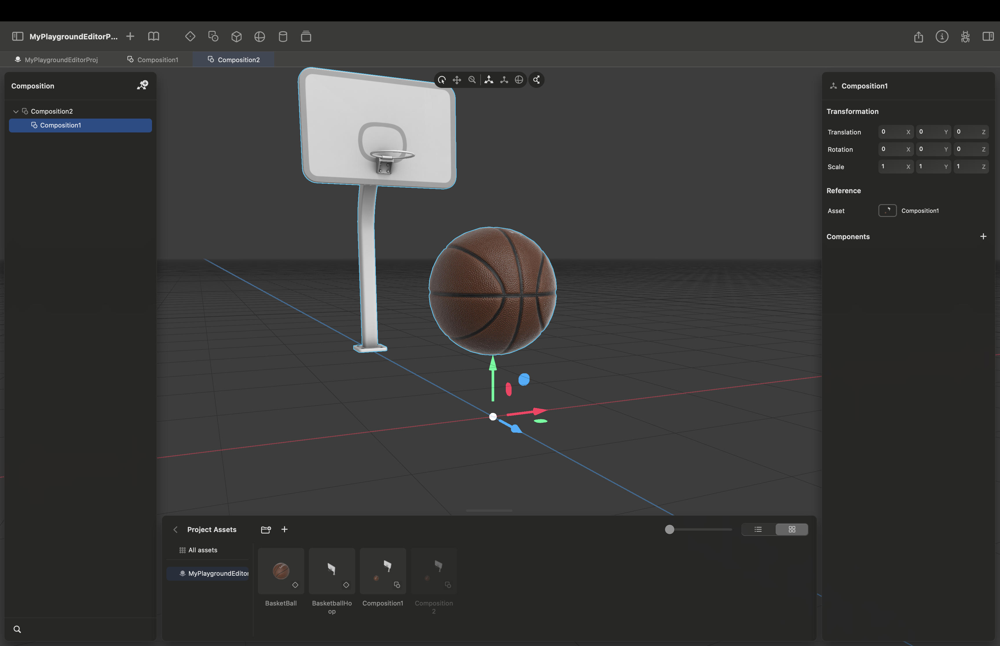

### 4.4 Composition Hierarchy
In this section, we'll go over how to create hierarchy by nesting compositions and parenting nodes.

#### Create a new composition
To create a new composition, you can look to the top bar. The icon with a square and small circle, should be the add composition button. You can hover over each button to see a description to be sure.

#### Nest the basketball+hoop composition
Now we can take our previous composition with the basketball and hoop and add it to our new composition. We can then move it around as if it were an object. Let's add asecond instance of the basketball and hoop composition, so that we now have a basketball court.

#### Add a null node
There's another way to create hierarchy in your project. You can parent nodes to one another. Let's add an empty, or null, node that we'll use to be the parent of the two hoop and ball compisitions so that they move as one cohesive unit. You can do this on the left hand panel, where there's a button on the top right to add a node. You can add assets to your nodes later if you want, but we'll leave this one empty.

#### Set the null node as the parent
We can make th null node the parent of the basketball+hoop nodes by using the left side panel. You can click and drag each basketball+hoop node to the empty node. You should now see the tree hierarchy of the nodes.

#### Scale down the court
Now that we have both halves of the court under one parent node, we can select the parent node, then scale it down. This will also scale down all of the children nodes, so our enitre basketball court will get smaller.

   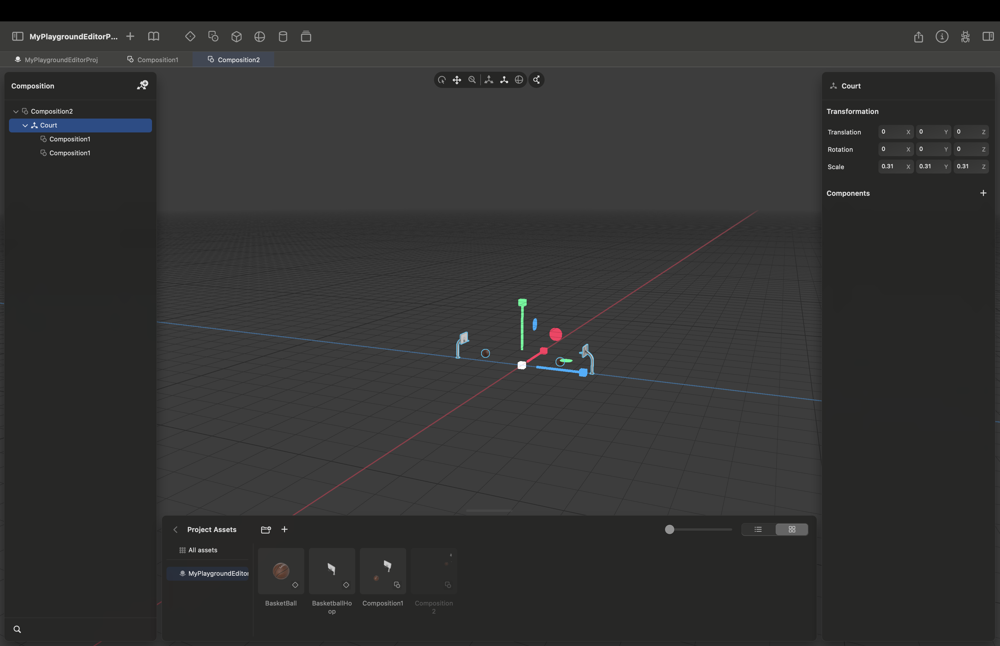

### 4.5 Using Spatial Editor with your Spatial SDK app

Now that you know the basics, it's time to use your project with your app. We have a premade basic environment of the Media App template. You can find it in your project files: `MediaAppTemplate/app/spatial_editor/MediaApp/Main.metaspatial`. You can close the previous project and open this one.

#### Explore the scene
As you can see, this scene mirrors the one created from code in the earlier section. You can explore the different values of the environment and panel.

#### Add the controller
If you noticed, the controller is missing. We should add it in the Spatial Editor. We can import the asset using the `+` button in the bottom panel or by dragging and dropping the controller file. You can find the controller asset at `MediaAppTemplate/app/src/quest/assets/Controller.glb`.

#### Add the Grabbable & Physics components
In the code, we were able to add different components with values to the objects we created. We can do the same thing in Spatial Editor. When a node is selected, you can add components using the right side panel. There is a drop down and you can select the component you want. You can then modify the different values of the component. You can add multiple components, so let's add the Grabbable and Physics components. Play around with the values.

   

### 4.6 Set up the Spatial SDK gradle plugin
Let's set up the Spatial SDK gradle plugin. This will help us export the Spatial Editor project to our app when we build the app, and will let us use our own custom components in Spatial Editor.

#### Add code to app/build.gradle.kts
We need to first add parts to the our app-level `build.gradle.kts`.

```diff
plugins {
    …
    id("com.meta.spatial.plugin") version "0.5.0"
    id("com.google.devtools.ksp") version "1.8.0-1.0.9" apply true
}
...
dependencies {
    ...
+   ksp("com.google.code.gson:gson:2.11.0")
+   ksp("com.meta.spatial.plugin:com.meta.spatial.plugin.gradle.plugin:0.5.0")
}

+ afterEvaluate {
+     tasks.named("assembleQuestDebug") {
+         dependsOn("export")
+     }
+}
+ spatial {
+    scenes {
+      exportItems {
+        item {
+          projectPath.set(
+              project.projectDir.absolutePath + "/spatial_editor/MediaApp/Main.metaspatial")
+          outputPath.set("app/src/quest/assets/scenes")
+        }
+      }
+      componentGeneration {
+        outputPath.set(project.projectDir.absolutePath + "/spatial_editor/MediaApp")
+      }
+    }
+}

```

#### Replace Code with Spatial Editor Project
Now that we have the project, let's replace the lines of code in our `ImmersiveActivity.kt` with code that inflates our Spatial Editor scene. Replace these lines in the `onSceneReady` function.

```diff
override fun onSceneReady() {
    super.onSceneReady()
    scene.setViewOrigin(0.0f, 0.0f, 0.0f)
    …

-    // Create entities
-    Entity.create(
-         listOf(
-             Mesh(mesh = Uri.parse("environment.glb")),
-             Transform(Pose(Vector3(0f, 0f, 1f), Quaternion(0f, 180f, 0f))),
-             Physics(dimensions = Vector3(5f, 0.1f, 5f), state = PhysicsState.STATIC),
-             SupportsLocomotion()))

+    activityScope.launch {
+        glXFManager.inflateGLXF(
+            Uri.parse("apk:///scenes/AppScene.glxf"),
+            keyName = "scene")
+    }

...

-    Entity.createPanelEntity(R.id.main_panel, Transform(Pose(Vector3(0f, 1.3f, 2f), Quaternion(0f, 0f, 0f))))

    scene.updateIBLEnvironment("chromatic.env")
}
```

#### Run your app

Now that your app uses your Spatial Editor Project. Any changes you make and save in your Spatial Editor project will be reflected when you rebuild your app. You should be able to grab and drop your controller as well because you added the Grabbable and Physics components.

#### Add code functionality to Spatial Editor Objects
While you're creating these objects from Spatial Editor, you can still query them and add functionality. Below is some code that will add a listener that will turn the play button green when it was clicked, and then turn it silver again when any other part of the controller is clicked. You could modify this so that each button performs certain actions and even communicates with your panel!

For this we'll need to create a new `MediaControllerSystem.kt` and then rgister that system in your activity.

```kotlin
package com.meta.media.template

import android.graphics.Color
import com.meta.spatial.core.Entity
import com.meta.spatial.core.SystemBase
import com.meta.spatial.runtime.InputListener
import com.meta.spatial.toolkit.GLXFManager
import com.meta.spatial.runtime.SceneObject
import com.meta.spatial.toolkit.SceneObjectSystem
import com.meta.spatial.runtime.HitInfo

class MediaControllerSystem(private val glXFManager: GLXFManager) : SystemBase() {

  private var setInputListener = false

  override fun execute() {
    if (!setInputListener) {
      val controllerEntity =
          glXFManager.tryGetGLXFInfo("scene")?.getNodeByName("Controller")?.entity
      if (controllerEntity != null) {
        val sceneObject =
            systemManager.findSystem<SceneObjectSystem>()?.getSceneObject(controllerEntity)
        if (sceneObject != null) {
          setInputListener = true
          sceneObject.thenAccept {
            it.addInputListener(
                object : InputListener {
                  override fun onClick(
                      receiver: SceneObject,
                      hitInfo: HitInfo,
                      sourceOfInput: Entity
                  ) {
                    val nodeId = hitInfo.nodeId
                    val nodeName =
                        receiver.mesh?.nodeNameToId?.entries?.find { it.value == nodeId }?.key
                    receiver.mesh?.materials?.forEach { it.setAlbedoColor(Color.valueOf(0xc0c0c0)) }
                    if (nodeName == "Controller_button_play") {
                      receiver.mesh
                          ?.getMaterial("Controller_button_play")
                          ?.setAlbedoColor(Color.valueOf(0x00ff00))
                      // Play Button Pressed. Do something else here
                    }
                  }
                })
          }
        }
      }
    }
  }
}
```

Now we register our system in our activity.

```diff
override fun onCreate(savedInstanceState: Bundle?) {
  super.onCreate(savedInstanceState)
+ systemManager.registerSystem(
+    MediaControllerSystem(glXFManager, this.applicationContext))
}
```

Now when we run the app, the listener will be active on our controller, and the play button will turn green when pressed.


## 5. Making a Hybrid app
This section covers
* Preparing your app's settings to enable hybrid switching
* Writing the logic to start the immersive and panel activities

### 5.1 Enable hybrid switching
1. Begin by adding these lines to the top of your `AndroidManifest.xml` in the quest folder of your project.
```diff
<?xml version="1.0" encoding="utf-8"?>
<manifest xmlns:android="http://schemas.android.com/apk/res/android"
+   xmlns:horizonos="http://schemas.horizonos/sdk">

+   <horizonos:uses-horizonos-sdk
+       horizonos:minSdkVersion="57"
+       horizonos:targetSdkVersion="69" />
```

### 5.2 Switching between immersive and panel modes
1. To simplify the process, we're going to override the functionality of a pre-existing button in our `MainActivity` panel to do the mode switching. Start by adding a variable to the top of `MainFragment.kt` to track which state we're in.
```diff
class MainFragment : Fragment() {
  private var movieList: ArrayList<MediaTitle> = ArrayList()
  private val viewModel by activityViewModels<AppViewModel>()
  private lateinit var currentView: View
+ private var panelMode = false
```

2. Every time the application switches modes, it's going to restart the `MainActivity`. To properly keep track of the current state through each restart, we'll need to pass the current state in as an Intent extra. However, we first need to check our Intent extras in `onCreateView()` and set our state accordingly.
```diff
override fun onCreateView(...): View {
+ panelMode = activity?.intent?.getBooleanExtra("panelMode", false)!!
```

3. Next, comment out or remove the existing button logic, then write the logic to launch the appropriate activity depending on our state.
```diff
private tun switchToThirdPartyNotice() {
//parentFragmentManager.commit {
//  addToBackStack("third_party_notice")
//  replace(R.id.container, ThirdPartyNoticeFragment())
//}
+ if(panelMode) {
+   val immersiveIntent =
+     Intent(context, ImmersiveActivity::class.java).apply {
+       action = Intent.ACTION_MAIN
+       addFlags(Intent.FLAG_ACTIVITY_NEW_TASK)
+       putExtra("panelMode", false)
+     }
+   startActivity(immersiveIntent)
+   activity?.finishAffinity()
+ }
```
Switching from panel mode to immersive mode (shown above) is relatively straightforward. Create a standard android intent with the panelMode extra to pass our new state to the activity. Then, `finishAffinity()` to ensure the panel and all subactivities (say, a video playing) will be closed. Next, we want to handle switching from immersive mode to panel mode.
```diff
+ else {
+   val panelIntent =
+     Intent(context, MainActivity::class.java).apply {
+       action = Intent.ACTION_MAIN
+       addFlags(Intent.FLAG_ACTIVITY_NEW_TASK)
+       addFlags(Intent.FLAG_ACTIVITY_MULTIPLE_TASK)
+       putExtra("panelMode", true)
+     }

    // Wrap the created Intent in a PendingIntent object
+   val pendingPanelIntent =
+     PendingIntent.getActivity(
+       context,
+       0,
+       panelIntent,
+       PendingIntent.FLAG_CANCEL_CURRENT or PendingIntent.FLAG_MUTABLE)

    // Create and send the Intent to launch the Home environment, providing
    // the PendingIntent object as extra parameters
+   val homeIntent =
+     Intent(Intent.ACTION_MAIN)
+       .addCategory(Intent.CATEGORY_HOME)
+       .addFlags(Intent.FLAG_ACTIVITY_NEW_TASK)
+       .putExtra("extra_launch_in_home_pending_intent", pendingPanelIntent)
+   context?.startActivity(homeIntent)
+ }
```
As you can see, switching from immersive to panel mode is slightly more complicated. First, we create an intent to launch the `MainActivity` with the panelMode state as we did before. However, immersive apps cannot directly launch panel apps; only the Home environment activity can do that. We can achieve this by creating a PendingIntent, which tells one intent to launch another intent that we provide. Finally, we create the home intent (passing in the PendingIntent), which launches the Home environment and starts our panel app.

Build and run your app, and you should be able to click the portrait button in the upper right of the panel to toggle between panel and immersive modes.

## 6. Creating custom components and systems
This section covers
* Creating a custom component
* Creating a custom system that drives the component
* Registering a component and system

### 6.1 Creating a custom component
1. We're going to make a very simple component that causes its entity object to always face the user (known as "billboarding"). First, write a component class that extends 'ComponentBase' by creating a new file called "LookAtUser.kt" and paste the following inside.
```
package com.meta.media.template

import com.meta.aether.core.ComponentBase
import com.meta.aether.core.ComponentCompanion

class LookAtUser : ComponentBase() {
    override fun typeID(): Int {
        return LookAtUser.id
    }

    companion object : ComponentCompanion {
        override val id = R.id.LookAt_class
        override val createDefaultInstance = { LookAtUser() }
    }
}
```
We don't have any attributes for our component, so we only need the required overrides from `ComponentBase`

2. Next, we'll add the id we used above to 'ids.xml'.
```diff
<resources>
  <item type="id" name="main_panel" />
+ <item type="id" name="LookAt_class"/>
</resources>
```

### 6.2 Creating a custom system
1. Systems contain the logic that operates on a set of entities with one or multiple components attached. Add the code below to a new file called `LookAtUserSystem.kt`.
```
package com.meta.media.template

import com.meta.aether.core.Pose
import com.meta.aether.core.Quaternion
import com.meta.aether.core.Query
import com.meta.aether.core.SystemBase
import com.meta.aether.toolkit.Transform

class LookAtUserSystem : SystemBase() {

    override fun execute() {
        var headPose: Pose = getScene()!!.getViewerPose()

        val q = Query.where { has(LookAtUser.id, Transform.id) }
        for (entity in q.eval()) {
            var eyePose: Pose =
                entity.getComponent<Transform>().transform

            eyePose.q =
                Quaternion.lookRotation((eyePose.t - headPose.t))

            entity.setComponent(Transform(eyePose))
        }
    }
}
```
Let's break down what this system does. The `execute()` method is a lifecycle method that runs once per tick for the application. Ticks are not the same thing as frames and do not run at the same rate as frames. Sometimes it runs more frequently and sometimes less frequently, depending on your app. In this method, we do the following:
* Get the user's current head position.
* Get a list of all entities that have our `LookAtUser` component attached, as well a `Transform` component. This is done with the `Query` class.
* For each entity in our list, get its current `Pose` (position and rotation), get the vector from the user's head position to the entity position, determine the rotation required from the vector, and set the entity's rotation equal to the new rotation.

### 6.3 Registering a component and/or system
1. Now that we've written our component and system, the last step is to register them and attach the component to an entity to see if it works. In `ImmersiveActivity.kt` we'll do the registration.
```diff
override fun onCreate(savedInstanceState: Bundle?) {
  super.onCreate(savedInstanceState)
+ componentManager.registerComponent<LookAtUser>(LookAtUser.Companion)
+ systemManager.registerSystem(LookAtUserSystem())
  systemManager.registerSystem(MediaControllerSystem(glXFManager, this.applicationContext))
}
```

2. Last but not least, attach the component to the Panel entity in the scene.
```diff
override fun onSceneReady() {
. . .
  activityScope.launch {
    glXFManager.inflateGLXF(
      Uri.parse("apk:///scenes/AppScene.glxf"),
      keyName = "scene")
+ }.invokeOnCompletion {
+   val composition = glXFManager.getGLXFInfo("scene")
+   val panel = composition.getNodeByName("Panel 1").entity
+   panel.setComponent(LookAtUser())
+ }
```
After the scene is inflated, find the entity named "Panel 1" and attach the `LookAtUser` component to it. If you build and run your app now, you should see that the panel rotates to face you at all times.
