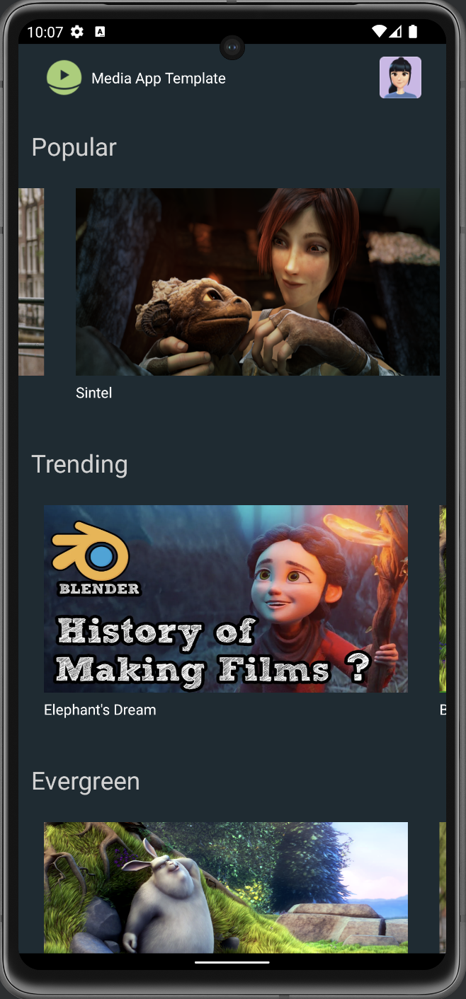
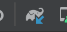
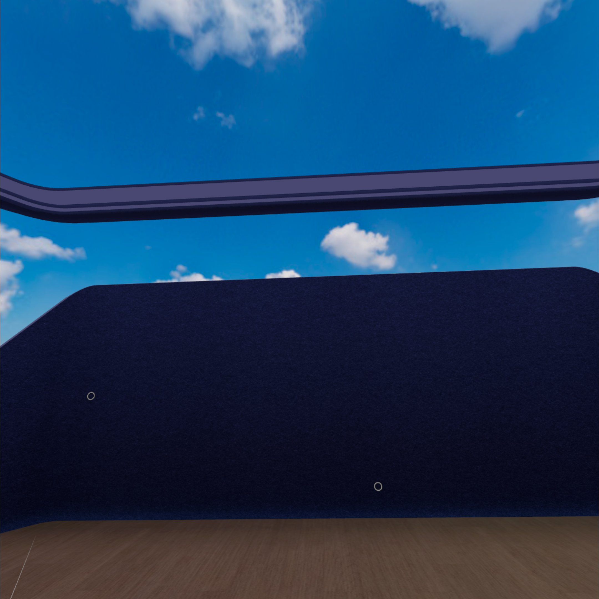

# Meta Spatial App Code Lab

## Requirements
1. [Android Studio](https://developer.android.com/studio)
2. Android SDK 34, and build tools.
3. Quest devices with Horizon OS v69+, and developer mode enabled.
4. (Optional) Android Emulator

## Running the sample app on Quest.
This section covers
* Porting the mobile android app to Quest, creating a separate target with [ProductFlavors](https://developer.android.com/reference/tools/gradle-api/7.4/com/android/build/api/dsl/ProductFlavor) to showcase Cross-platform-ness (one codebase, multiple targets) and make customizations for Quest target.

### Setup
1. Make sure your setup meet the [requirements](#requirements).
2. Clone this project from github.

   `git clone https://github.com/fbsamples/MediaSpatialAppTemplate.git`
3. Open and import the project in Android studio.
4. (Optional) Start the app on Android Emulator or a Physical Android Device. You will see something like following screenshot.
   

### Add Quest build flavor
1. Open `build.gradle.kts` in app module. add following code under `android` block.
```diff title="build.gradle.kts"
android {
  namespace = "com.meta.media.template"
  ...

+ buildFeatures { buildConfig = true }
+ flavorDimensions += "device"
+ productFlavors {
+  create("mobile") { dimension = "device" }
+  create("quest") { dimension = "device" }
+ }
}
```
2. Create two new folders under `app/src` with names "mobile" and "quest". Copy `AndroidManifest.xml` from `src/main` folder to each of the new folders.
3. Sync the project with the new gradle files. 
4. Switch current build variant to 'quest'. In menu, select `Build -> Select Build Variant`. In the Build Variants window, select `questDebug` as the active build variant.
  
* Update `AndroidManifest.xml` in `app/src/quest` with follow code.
```diff
<?xml version="1.0" encoding="utf-8"?>
...
   <application
       ...
       <activity
           android:name=".MainActivity"
+          android:screenOrientation="landscape"
...
```
5. Connect the Quest device to your MAC/PC, select the connected device in Android Studio as the target device, and start the app.
   
6. Put on your headset, you will see the app is launched in landscape mode.
   

## Display the app in an immersive scene
This section covers
* Add Meta Spatial SDK into the project and create an immersive scene to display the app in panels.
* Customize the immersive scene environment with Skybox.

### Add Meta Spatial SDK
1. Download the Meta Spatial SDK library. (link tbd)
2. Create a new folder named `libs` under `app` folder, copy all downloaded aars into the folder.
3. Import the libraries into the project by updating the `build.gradle.kts` under `app` folder. Add following dependencies.
```diff
dependencies {
...
 implementation("androidx.media3:media3-ui:1.3.1")

+ implementation (files("libs/aether.aar"))
+ implementation (files("libs/aether-physics.aar"))
+ implementation (files("libs/aether-toolkit.aar"))
+ implementation (files("libs/aether-vr.aar"))
  // Aether dependencies
+ implementation ("com.squareup.okhttp3:okhttp:4.9.1")

 testImplementation("junit:junit:4.13.2")
...
}
```
4. Sync the project with the new gradle files.

### Start an immersive scene
1. Under `app/src/quest` folder, create a new folder named `java` with a new package `com.meta.media.template` under it. (should created)
2. Create a new activity file 'ImmersiveActivity.kt' under the package we created. With following content.
```kotlin
package com.meta.media.template

import android.net.Uri
import com.meta.aether.core.AetherFeature
import com.meta.aether.core.Entity
import com.meta.aether.core.Pose
import com.meta.aether.core.Quaternion
import com.meta.aether.core.Vector3
import com.meta.aether.toolkit.AppSystemActivity
import com.meta.aether.toolkit.Material
import com.meta.aether.toolkit.Mesh
import com.meta.aether.toolkit.Transform
import com.meta.aether.vr.VRFeature

class ImmersiveActivity : AppSystemActivity() {

   override fun registerFeatures(): List<AetherFeature> {
      return listOf(VRFeature(this))
   }

   override fun onSceneReady() {
      super.onSceneReady()
      scene.setViewOrigin(0.0f, 0.0f, 0.0f)
      scene.enableHolePunching(true)

      // Create entities
      Entity.create(
         listOf(
            Mesh(mesh = Uri.parse("environment.glb")),
            Transform(Pose(Vector3(0f, 0f, 1f), Quaternion(0f, 180f,0f)))))

      Entity.create(
         listOf(
            Mesh(Uri.parse("mesh://skybox")),
            Material().apply {
               baseTextureAndroidResourceId = R.drawable.skybox
               unlit = true
            })
      )
   }
}
```
4. Open the `AndroidManifest.xml` under `app/src/main`, delete the `<activity>` tags under the `<application>` tags.
5. Open the `AdnroidManifest.xml` under `app/src/quest`, with following code changes under `<manifest>` tag.
```diff
<?xml version="1.0" encoding="utf-8"?>
<manifest xmlns:android="http://schemas.android.com/apk/res/android"
    xmlns:tools="http://schemas.android.com/tools">

    <!-- Meta Quest/VR Specific Features/Permissions -->
    <!-- Support controller models -->
+    <uses-feature
+       android:name="com.oculus.feature.RENDER_MODEL"
+       android:required="false" />
+   <uses-permission android:name="com.oculus.permission.RENDER_MODEL" />
   <!-- Support Quest keyboard -->
+   <uses-feature
+       android:name="com.oculus.feature.VIRTUAL_KEYBOARD"
+       android:required="false" />
+   <uses-feature
+       android:name="oculus.software.overlay_keyboard"
+       android:required="false" />
   <!-- App runs in 6DoF mode -->
+   <uses-feature android:name="android.hardware.vr.headtracking"
+       android:required="true" />
   <!-- Support hand tracking -->
+   <uses-feature
+       android:name="oculus.software.handtracking"
+       android:required="false" />
+   <uses-permission android:name="com.oculus.permission.HAND_TRACKING" />

    <uses-permission android:name="android.permission.INTERNET" />

...

       <activity
           android:name=".MainActivity"
           android:screenOrientation="landscape"
           android:exported="true"
           android:allowEmbedded="true">
-           <intent-filter>
-               <action android:name="android.intent.action.MAIN" />
-               <category android:name="android.intent.category.LAUNCHER" />
-           </intent-filter>
       </activity>
+      <activity
+           android:name=".ImmersiveActivity"
+           android:theme="@android:style/Theme.Black.NoTitleBar.Fullscreen"
+           android:launchMode="singleTask"
+           android:excludeFromRecents="false"
+           android:screenOrientation="landscape"
+           android:configChanges="screenSize|screenLayout|orientation|keyboardHidden|keyboard|navigation|uiMode"
+           android:exported="true">
+           <intent-filter>
+               <action android:name="android.intent.action.MAIN" />
+               <category android:name="com.oculus.intent.category.VR" />
+               <category android:name="android.intent.category.LAUNCHER" />
+           </intent-filter>
+       </activity>

...
```
6. Start the app on Quest device, you should see an immersive scene without anything.
   

### Import the panel
In this section, we will adding our activity to the immersive scene and render it as an panel

1. Under `app/src/quest/res/values` folder, create a new resource file `ids.xml` with following content
```xml
<resources>
    <item type="id" name="main_panel" />
</resources>
```
2. In `ImmsersiveActivity.kt`, override the method `registerPanels` in ImmersiveActivity to register an panel.
```kotlin
override fun registerPanels(): List<PanelRegistration> {
    return listOf(
        PanelCreator(R.id.main_panel) { entity ->
          val intent = Intent().apply {
            setClassName(applicationContext, MainActivity::class.qualifiedName!!)

          }
          val panelSceneObject = PanelSceneObject(
              scene,
              aetherContext,
              intent,
              entity,
              PanelConfigOptions(
                  height = 2.16f,
                  width = 3.84f,
                  textureHeight = 1080,
                  textureWidth = 1920,
                  layerConfig = QuadLayerConfig(),
                  panelShader = SceneMaterial.HOLE_PUNCH_SHADER,
                  alphaMode = AlphaMode.HOLE_PUNCH))
          panelSceneObject
        })
  }
```
3. In `ImmsersiveActivity.kt`, add following code to `onSceneReady` method to create a Panel Entity.
```kotlin
override fun onSceneReady() {
  ...

+   Entity.createPanelEntity(
+      R.id.main_panel,
+      Transform(Pose(Vector3(0f, 1.3f, 2f), Quaternion(0f, 0f, 0f)))
+   )
}
```
4. Start the app, you should see the panel now display in the center of the scene.

### Load more items.
This

1. To add some lighting to the scene, copy the file `chromatic.env` to `app/src/quest/assets`.
2. In `ImmersirveActivity.kt`, add following code to `onSceneReady` method.
```kotlin
override fun onSceneReady() {
  ...
  scene.enableHolePunching(true)
+ scene.updateIBLEnvironment("chromatic.env")

  // Create entities
...
}
```
3. Add a TV remote into the scene, adding following code to `onSceneReady` method.
```kotlin
override fun onSceneReady() {
...
+   Entity.create(
+      listOf(
+         Mesh(Uri.parse("mesh://box")),
+         Box(Vector3(-0.05f, -0.02f, -0.12f), Vector3(0.05f, 0.002f, 0.12f)),
+         Material().apply {
+            baseColor = Color4(red = 1.0f, green = 0.1f, blue = 0.1f, alpha = 1.0f)
+         },
+         Transform(Pose(Vector3(0.0f, 1.0f, 0.3f), Quaternion(0f, 0f, 0f))),
+         Grabbable()))
}
```

### Add physics

1. Open the `ImmersiveActivity.kt`, for the TV remote entity we created, add `Physics` component.
```diff
override fun onSceneReady() {
   ...
   Entity.create(
     listOf(
        Mesh(Uri.parse("mesh://box")),
...
        Grabbable(),
+       Physics(dimensions = Vector3(0.1f, 0.04f, 0.24f), state = PhysicsState.DYNAMIC),
        ))
}
```
2. We also want to create a invisible floor prevent the TV remote drop out of the scene.
3. Inside `onSceneReady` method, add `Physics` to our environment Entity .
```diff
override fun onSceneReady() {
...
    Entity.create(
        listOf(
            Mesh(mesh = Uri.parse("environment.glb")),
            Transform(Pose(Vector3(0f, 0f, 1f), Quaternion(0f, 180f, 0f))),
+            Physics(dimensions = Vector3(5f, 0.1f, 5f), state = PhysicsState.STATIC)
        ))
...
}
```
