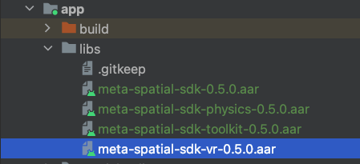

# Meta Spatial App Code Lab

## Requirements
1. [Android Studio](https://developer.android.com/studio)
2. Android SDK 34, and build tools.
3. Quest devices with Horizon OS v69+, and developer mode enabled.
4. (Optional) Android Emulator

## 1. Running the sample app on Quest.
This section covers
* Porting the mobile Android app to Quest, creating separate build variants with [ProductFlavors](https://developer.android.com/reference/tools/gradle-api/7.4/com/android/build/api/dsl/ProductFlavor) to showcase Cross-platform-ness (one codebase, multiple targets).

### 1.1 Setup
1. Make sure your setup meet the [requirements](#requirements).
2. Clone this project from Github.
   `git clone https://github.com/fbsamples/MediaSpatialAppTemplate.git`
3. Open and import the project into Android studio.
4. (Optional) Start the app in Android Emulator or on a connected Android Device. You will see something like following screenshot.


### 1.2 Add Quest build flavor
1. Open `build.gradle.kts` in app module(`app/src/`).  add following code into the `android` block.
```diff
android {
  namespace = "com.meta.media.template"
  ...

+ buildFeatures { buildConfig = true }
+ flavorDimensions += "device"
+ productFlavors {
+  create("mobile") { dimension = "device" }
+  create("quest") { dimension = "device" }
+ }
}
```
2. Create two new folders under `app/src` with names `mobile` and `quest` and copy the `AndroidManifest.xml` from `src/main` folder into them. we'll use these folders to manage the differences between the mobile (phone) version of our app and the Quest (Meta Spatial SDK) version.  
   
3. Sync the project with the new gradle files.  
   
4. Switch current build variant to 'quest'. In menu, select `Build -> Select Build Variant`. In the Build Variants window, select `questDebug` as the active build variant.  
   
5. Update `AndroidManifest.xml` in `app/src/quest` with follow code.
```xml
<?xml version="1.0" encoding="utf-8"?>
...
   <application
       ...
       <activity
           android:name=".MainActivity"
+          android:screenOrientation="landscape"
...
```
6. Connect the Quest device to your MAC/PC, select the connected device in Android Studio as the target device, and start the app.  
   
6. Put on your headset, you will see the app is launched in landscape mode.  
   

## 2. Display the app in an immersive scene
This section covers
* Add Meta Spatial SDK into the project.
* Create an immersive scene with skybox and room environment.
* Render the android app as a panel in the immersive scene.

### 2.1 Add Meta Spatial SDK
1. Download the Meta Spatial SDK library.
2. Create a new folder named `libs` under `app` folder, and copy all downloaded .aar files into it.  
   
3. Import the libraries into the project by updating the `build.gradle.kts` under `app` folder. Add following dependencies.
```diff
dependencies {
...
  implementation("androidx.media3:media3-ui:1.3.1")

+ implementation (files("libs/meta-spatial-sdk-0.4.2.aar"))
+ implementation (files("libs/meta-spatial-sdk-physics-0.4.2.aar"))
+ implementation (files("libs/meta-spatial-sdk-toolkit-0.4.2.aar"))
+ implementation (files("libs/meta-spatial-sdk-vr-0.4.2.aar"))
+ // Meta Spatial SDK dependencies
+ implementation ("com.squareup.okhttp3:okhttp:4.9.1")

  testImplementation("junit:junit:4.13.2")
...
}
```
4. Sync the project with the new gradle files.

### 2.2 Start an immersive scene
1. Copy the skybox image `skybox.jpg` from `codelabs/resources/` to `app/src/quest/res/drawable`, and copy the room model file `environment.glb` from `codelabs/resources/` to `app/src/quest/assets`.  
   
2. Under `app/src/quest` folder, create a new folder named `java` with a new package `com.meta.media.template` under it.
3. Create a new kotlin file `ImmersiveActivity.kt` under the package we created. With following content.
```kotlin
package com.meta.media.template

import com.meta.spatial.core.SpatialFeature
import com.meta.spatial.toolkit.AppSystemActivity
import com.meta.spatial.vr.VRFeature

class ImmersiveActivity : AppSystemActivity() {

   override fun registerFeatures(): List<SpatialFeature> {
      return listOf(VRFeature(this))
   }

   override fun onSceneReady() {
      super.onSceneReady()
      scene.setViewOrigin(0.0f, 0.0f, 0.0f)
   }
}
```
4. Inside `onSceneReady()` methods, create three entities, a room environment, a skybox and a red cube.
```diff
+import android.net.Uri
+import com.meta.spatial.core.Entity
+import com.meta.spatial.core.Pose
+import com.meta.spatial.core.Quaternion
+import com.meta.spatial.core.Vector3
+import com.meta.spatial.toolkit.Box
+import com.meta.spatial.toolkit.Color4
+import com.meta.spatial.toolkit.Material
+import com.meta.spatial.toolkit.Mesh
+import com.meta.spatial.toolkit.Transform

   override fun onSceneReady() {
      super.onSceneReady()
      scene.setViewOrigin(0.0f, 0.0f, 0.0f)

+    // Create Entities
+    Entity.create(
+        listOf(
+            Mesh(mesh = Uri.parse("environment.glb")),
+            Transform(Pose(Vector3(0f, 0f, 1f), Quaternion(0f, 180f, 0f)))))

+    Entity.create(
+        listOf(
+            Mesh(Uri.parse("mesh://skybox")),
+            Material().apply {
+              baseTextureAndroidResourceId = R.drawable.skybox
+              unlit = true
+            }))

+    Entity.create(
+        listOf(
+            Mesh(Uri.parse("mesh://box")),
+            Box(Vector3(-0.1f, -0.1f, -0.1f), Vector3(0.1f, 0.1f, 0.1f)),
+            Material().apply {
+              baseColor = Color4(red = 1.0f, green = 0.1f, blue = 0.1f, alpha = 1.0f)
+            },
+            Transform(Pose(Vector3(0.0f, 0.2f, 1.5f), Quaternion(0f, 0f, 0f)))))

      )
   }
```
5. Open the `AndroidManifest.xml` under `app/src/main`, comment-out or delete the `activity` tags under the `application` tags.  
   
6. Open the `AdnroidManifest.xml` under `app/src/quest`, with following code changes under `manifest` tag. This step added need features for the app and update the main entry of the app to the ImmersiveActivity.
```diff
<?xml version="1.0" encoding="utf-8"?>
<manifest xmlns:android="http://schemas.android.com/apk/res/android"
    xmlns:tools="http://schemas.android.com/tools">

+   <!-- Meta Quest/VR Specific Features/Permissions -->
+   <!-- Support controller models -->
+   <uses-feature
+       android:name="com.oculus.feature.RENDER_MODEL"
+       android:required="false" />
+   <uses-permission android:name="com.oculus.permission.RENDER_MODEL" />
+   <!-- App runs in 6DoF mode -->
+   <uses-feature android:name="android.hardware.vr.headtracking"
+       android:required="true" />
+   <!-- Support hand tracking -->
+   <uses-feature
+       android:name="oculus.software.handtracking"
+       android:required="false" />
+   <uses-permission android:name="com.oculus.permission.HAND_TRACKING" />

    <uses-permission android:name="android.permission.INTERNET" />
...

       <activity
           android:name=".MainActivity"
           android:screenOrientation="landscape"
           android:exported="true"
           android:allowEmbedded="true">
-           <intent-filter>
-               <action android:name="android.intent.action.MAIN" />
-               <category android:name="android.intent.category.LAUNCHER" />
-           </intent-filter>
       </activity>
+      <activity
+           android:name=".ImmersiveActivity"
+           android:theme="@android:style/Theme.Black.NoTitleBar.Fullscreen"
+           android:launchMode="singleTask"
+           android:excludeFromRecents="false"
+           android:screenOrientation="landscape"
+           android:configChanges="screenSize|screenLayout|orientation|keyboardHidden|keyboard|navigation|uiMode"
+           android:exported="true">
+           <intent-filter>
+               <action android:name="android.intent.action.MAIN" />
+               <category android:name="com.oculus.intent.category.VR" />
+               <category android:name="android.intent.category.LAUNCHER" />
+           </intent-filter>
+       </activity>
```
6. Start the app on Quest device, you should see an immersive scene like below.  
   

### 2.3 Import the panel
1. Under `app/src/quest/res/values` folder, create a new resource file `ids.xml` with following content.
```xml
<resources>
    <item type="id" name="main_panel" />
</resources>
```
2. In `ImmsersiveActivity.kt`, override the method `registerPanels` in ImmersiveActivity to register a panel.
```diff
+import android.content.Intent
+import com.meta.spatial.toolkit.PanelRegistration
+import com.meta.spatial.runtime.AlphaMode
+import com.meta.spatial.runtime.QuadLayerConfig
+import com.meta.spatial.runtime.SceneMaterial

...
  }

+  override fun registerPanels(): List<PanelRegistration> {
+    return listOf(
+        PanelRegistration(R.id.main_panel) {
+          panelIntent =
+              Intent().apply {
+                setClassName(applicationContext, MainActivity::class.qualifiedName!!)
+              }
+          config {
+            height = 2.16f
+            width = 3.84f
+            layoutHeightInPx = 1080
+            layoutWidthInPx = 1920
+            layerConfig = QuadLayerConfig()
+            panelShader = SceneMaterial.HOLE_PUNCH_SHADER
+            alphaMode = AlphaMode.HOLE_PUNCH
+          }
+        })
+  }

  override fun onSceneReady() {
...
```
3. In `ImmsersiveActivity.kt`, add following code to `onSceneReady` method to create a Panel Entity.
```diff
override fun onSceneReady() {
  ...

+   Entity.createPanelEntity(
+      R.id.main_panel,
+      Transform(Pose(Vector3(0f, 1.3f, 2f), Quaternion(0f, 0f, 0f)))
+   )
}
```
4. Start the app, you should see the panel is displayed in the center of the scene.  
   

## 3. Core 3D capabilities
This section covers
* Add lighting to the immersive environment.
* Import gltf 3D model to the scene.
* Basic physics for 3D.

### 3.1 Add Lighting
1. Copy the IBL(Image Based Lighting) file `chromatic.env` from `codelabs/resources` to `app/src/quest/assets`.  
   
2. In `ImmersirveActivity.kt`, add following code to `onSceneReady` method. `setLightingEnvironment` set the environment lighting for the scene, and mixed up with IBL.
```diff
...
  override fun onSceneReady() {
    super.onSceneReady()
    scene.setViewOrigin(0.0f, 0.0f, 0.0f)
+    scene.setLightingEnvironment(
+      ambientColor = Vector3(1.0f, 1.0f, 0.5f),
+      sunColor = Vector3(1.0f, 1.0f, 0.5f),
+      sunDirection = -Vector3(1.0f, 3.0f, 2.0f),
+      environmentIntensity = 0.5f
+    )
+    scene.updateIBLEnvironment("chromatic.env")
...
}
```
3. Start the the app, now the scene become much brighter.  
   

### 3.2 Enable physics
1. Enable the physics features in `ImmersiveActivity`'s feature list. Update the method `registerFeatures`.
```diff
+import com.meta.spatial.physics.PhysicsFeature

...
  override fun registerFeatures(): List<SpatialFeature> {
-    return listOf(VRFeature(this))
+    return listOf(VRFeature(this), PhysicsFeature(spatial))
  }
...
```
2. Copy the TV controller model file `Controller.glb` from `codelabs/resources` to `app/src/quest/assets`.
3. In `ImmersiveActivity`'s `onSceneReady` method, Replace the cube entity with the TV controller 3D model. Add `Grabbable` and `Physics` component to the entity. `Grabbable` make the model can be grabbed by controllers' grab key.
```diff
+import com.meta.spatial.physics.Physics
+import com.meta.spatial.physics.PhysicsState
+import com.meta.spatial.toolkit.Grabbable

...
  override fun onSceneReady() {
    super.onSceneReady()
...

-    Entity.create(
-        listOf(
-            Mesh(Uri.parse("mesh://box")),
-            Box(Vector3(-0.1f, -0.1f, -0.1f), Vector3(0.1f, 0.1f, 0.1f)),
-            Material().apply {
-              baseColor = Color4(red = 1.0f, green = 0.1f, blue = 0.1f, alpha = 1.0f)
-            },
-            Transform(Pose(Vector3(0.0f, 0.2f, 1.5f), Quaternion(0f, 0f, 0f)))))

+    Entity.create(
+        listOf(
+            Mesh(Uri.parse("Controller.glb")),
+            Transform(Pose(Vector3(0.0f, 0.2f, 0.5f), Quaternion(0f, 0f, 0f))),
+            Grabbable(),
+            Physics(
+                dimensions = Vector3(0.1f, 0.04f, 0.24f),
+                density = 0.01f,
+                state = PhysicsState.DYNAMIC),
+        ))

    Entity.createPanelEntity(
        R.id.main_panel, Transform(Pose(Vector3(0f, 1.3f, 2f), Quaternion(0f, 0f, 0f))))
  }

```
4. Inside `onSceneReady` method, create an invisible floor so the controller model can interact with it and won't fall out of the scene.
```diff
...
  override fun onSceneReady() {
    super.onSceneReady()
...

    Entity.create(
        listOf(
            Mesh(Uri.parse("Controller.glb")),
            Transform(Pose(Vector3(0.0f, 0.2f, 0.5f), Quaternion(0f, 0f, 0f))),
            Grabbable(),
            Physics(
                dimensions = Vector3(0.1f, 0.04f, 0.24f),
                density = 0.01f,
                state = PhysicsState.DYNAMIC),
        ))

+    Entity.create(
+        listOf(
+            Transform(Pose(Vector3(0f, -0.4f, 0f), Quaternion(0f, 0f, 0f))),
+            Physics(dimensions = Vector3(10f, 0.5f, 10f), state = PhysicsState.STATIC)))
...
}
```
5. Start the app, try grab the TV controller from the floor, and release the grab key to see what happens.  
   
